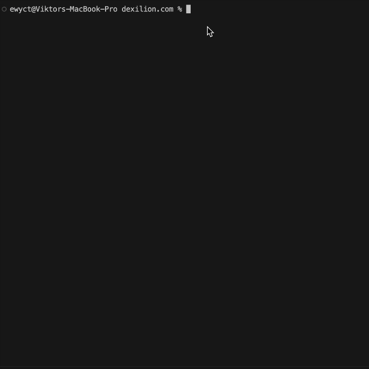

# lasTest

> AI-powered automated visual testing CLI that compares live vs dev environments mostly for vibe-coders.
[](https://github.com/dexilion-team/lastest/actions/workflows/ci.yml)
[](https://www.npmjs.com/package/@dexilion/lastest)
[](https://opensource.org/licenses/MIT)

```
╔═══════════════════════════════════════════════════════════════════════════╗
║   /\_/\           █████████████████████████████████████████████████████╗  ║
║  ( o.o )          ╚════════════════════════██╔═════════════════════════╝  ║
║   > ^ <   |\_/|   ██╗      █████╗ ███████╗ ██║ ███████╗███████╗████████╗  ║
║  /|   |\ ( o.o )  ██║     ██╔══██╗██╔════╝ ██║ ██╔════╝██╔════╝╚══██╔══╝  ║
║ (_|   |_) > ^ <   ██║     ███████║███████╗ ██║ █████╗  ███████╗   ██║     ║
║    | |   /     \  ██║     ██╔══██║╚════██║ ██║ ██╔══╝  ╚════██║   ██║     ║
║    |_|  /_______\ ███████╗██║  ██║███████║ ██║ ███████╗███████║   ██║     ║
║                   ╚══════╝╚═╝  ╚═╝╚══════╝ ╚═╝ ╚══════╝╚══════╝   ╚═╝     ║
║                                                                           ║
║                                                 Automated Visual Testing  ║
║                                                         made by Dexilion  ║
║                                                             dexilion.com  ║
║                                                                   v0.3.2  ║
╚═══════════════════════════════════════════════════════════════════════════╝
```

Automatically scans your codebase, generates Playwright tests using AI, and runs visual regression tests comparing your live and development environments. Get comprehensive reports with side-by-side screenshots and visual diffs. Perfect for vibe-coding.



## ✨ Features

### 🎯 Test Generation Modes (Choose Your Workflow)
- 🤖 **AI Mode** - Claude/Copilot generates intelligent tests with interactions (fast, smart)
- 📝 **Template Mode** - Simple screenshot tests without AI (fastest, free, no setup)
- 🔍 **MCP Mode** - AI + real-time validation for bulletproof tests (slowest, most reliable)
- 🎬 **Recording Mode** - Record interactions in browser, export as Playwright tests (full control)

### ⚡ Core Features
- ⏱️ **30s Frontend PR Testing** - Complete visual regression testing from install to report
- 📸 **Visual Regression Testing** - Pixel-perfect screenshot comparison across environments
- 🎨 **Beautiful Tabbed Reports** - Interactive HTML with Visual Comparison, Test Results & Step-by-Step views
- 📱 **Multi-Viewport Testing** - Test desktop, tablet, mobile viewports simultaneously
- 🔍 **Smart Route Detection** - Auto-discovers routes from Next.js, React Router, Vue Router, and more
- 🧠 **AI Route Detection** - Optional AI-powered discovery for complex routing patterns
- 🎯 **Custom Test Instructions** - Add your own AI instructions (e.g., "Click buttons, fill forms")
- 🎭 **Detailed Step Logging** - Tracks navigation, interactions, screenshots with timing
- ⚡ **Parallel Execution** - Run tests concurrently for blazing-fast results
- 💾 **Test Caching** - Generated tests cached for instant re-runs (no regeneration costs)
- 🔧 **Highly Configurable** - Customize everything via `.lastestrc.json`
- 📊 **Error Tracking** - Comprehensive error logging with optional email notifications

## 🚀 Quick Start

### Prerequisites

Choose based on your preferred test generation mode:

**For AI Mode** (one of the following):
- **Claude Pro or Claude Max subscription** + Claude CLI installed
- **GitHub Copilot subscription** (Pro/Business/Enterprise) + Copilot CLI installed (requires Node.js 22+)

**For Template/Recording Mode**: No AI subscription needed!

### Setup

```bash
npx @dexilion/lastest init
```

That's it! The CLI will guide you through:

1. **Test Generation Mode** - Choose: AI, Template, MCP, or Recording
2. **AI Provider** (if AI/MCP mode) - Choose between Claude or Copilot
3. **URLs** - Provide your live and dev URLs
4. **Viewport Options** - Test multiple screen sizes (desktop, tablet, mobile)
5. **Automated Testing** - Sit back while lasTest does the work

## 📦 Installation

### Global Installation

```bash
npm install -g @dexilion/lastest
```

### Local Installation

```bash
npm install --save-dev @dexilion/lastest
```

### npx (No Installation)

```bash
npx @dexilion/lastest init
```

## 📖 Usage

### Initial Setup

Run this to create your configuration and generate tests:

```bash
lastest init
```

This will:
- Guide you through configuration (mode selection, AI provider, URLs, viewports)
- Scan your codebase for routes (or start recording session)
- Generate tests using your chosen mode (AI, template, MCP, or recording)
- Create `.lastestrc.json` (config) and `.lastest-tests.json` (cached tests)
- Run the test suite across all environments and viewports
- Generate comprehensive HTML reports with visual diffs

### Re-running Tests

Once configured and tests are generated, simply run:

```bash
lastest
```

This will:
- Load your existing configuration and cached tests
- **Skip AI generation** (uses cached tests for faster execution)
- Run tests against both environments
- Generate a fresh report

### Regenerating Tests

To update your configuration or regenerate tests with AI:

```bash
lastest init
```

When you have an existing config, it will ask if you want to update it. This regenerates tests from scratch.

### With Options

```bash
lastest init \
  --live https://example.com \
  --dev http://localhost:3000 \
  --ai claude-subscription \
  --scan ./src
```

### Using Config File

The `.lastestrc.json` file is automatically created during `init`:

```json
{
  "aiProvider": "claude-subscription",
  "liveUrl": "https://example.com",
  "devUrl": "http://localhost:3000",
  "scanPath": "./src",
  "outputDir": "lastest-results",
  "viewport": {
    "width": 1920,
    "height": 1080
  },
  "diffThreshold": 1,
  "parallel": true,
  "maxConcurrency": 5
}
```

Or with GitHub Copilot:

```json
{
  "aiProvider": "copilot-subscription",
  "liveUrl": "https://example.com",
  "devUrl": "http://localhost:3000"
}
```

Then run:

```bash
lastest init
```

## 🎯 How It Works

lasTest offers **4 test generation modes** to fit your workflow:

### 🤖 AI Mode (Default - Fast & Smart)
1. **Scan** - Discovers routes from your codebase
2. **Generate** - AI creates intelligent Playwright tests with interactions
3. **Cache** - Saves tests to `.lastest-tests.json` for instant re-runs
4. **Execute** - Runs tests with step tracking and timing
5. **Compare** - Pixel-perfect screenshot comparison
6. **Report** - Beautiful tabbed HTML report

**Best for:** Most use cases, generates smart tests with interactions in seconds

### 📝 Template Mode (Fastest - No AI)
1. **Scan** - Discovers routes from your codebase
2. **Generate** - Creates simple screenshot tests (no AI needed)
3. **Cache** - Saves tests for re-runs
4. **Execute** - Runs basic screenshot tests
5. **Compare** - Visual comparison
6. **Report** - Full HTML report

**Best for:** Basic screenshot comparison, no AI costs, fastest generation

### 🔍 MCP Mode (Most Reliable - AI + Validation)
1. **Scan** - Discovers routes from your codebase
2. **Generate** - AI creates initial test code
3. **Validate** - MCP validates selectors against real pages
4. **Discover** - MCP finds additional interactions (buttons, forms)
5. **Refine** - AI improves tests based on MCP feedback
6. **Execute** - Runs validated tests with high reliability
7. **Report** - Comprehensive reports

**Best for:** Critical routes requiring bulletproof tests, eliminates selector guessing

### 🎬 Recording Mode (Full Control - Interactive)
1. **Launch** - Opens headed Chromium browser
2. **Record** - You interact naturally, all actions captured
3. **Screenshot** - Auto-screenshots on navigation, manual via Ctrl+Shift+S
4. **Stop** - Close browser or press Ctrl+R to finish
5. **Generate** - Converts recording to Playwright test
6. **Execute** - Runs recorded test
7. **Report** - Full HTML report

**Best for:** Complex workflows, full control, no AI hallucination

### Mode Comparison

| Feature | AI | Template | MCP | Recording |
|---------|-----|----------|-----|-----------|
| Speed | ⚡⚡ Fast | ⚡⚡⚡ Fastest | ⚡ Slow | 🎯 Manual |
| Cost | 💰 AI tokens | ✅ Free | 💰💰 AI tokens (2x) | ✅ Free |
| Setup | Medium | Easy | Complex | Easy |
| Reliability | Medium | Low | High | Highest |
| Control | Low | N/A | Low | Full |
| Interactions | Yes | No | Yes | Yes |

## 💳 AI Provider Options

**lasTest** supports two AI options - choose based on what you already have:

| Option | Cost | Setup | Best For |
|--------|------|-------|----------|
| **Claude Subscription** | Included with Pro/Max ($20-$200/mo) | CLI authentication | Existing Claude Pro/Max users |
| **GitHub Copilot** | Included with subscription ($10-$19/mo) | CLI authentication | Existing Copilot users |

### Using Claude Pro/Max Subscription

```bash
# One-time setup
npm install -g @anthropic-ai/claude-code
claude login

# Then use lasTest
lastest init --ai claude-subscription
```

### Using GitHub Copilot Subscription

```bash
# One-time setup (requires Node.js 22+)
npm install -g @github/copilot

# Authenticate (choose one):
# Option 1: Interactive login
copilot
# Then use /login command

# Option 2: Use GitHub token
export GITHUB_TOKEN=your_token

# Then use lasTest
lastest init --ai copilot-subscription
```

## 📊 Output

After running, you'll get:

```
lastest-results/
├── report.html          # Interactive HTML report with tabbed view
├── summary.md           # Markdown summary
├── screenshots/
│   ├── live/           # Live environment screenshots
│   └── dev/            # Dev environment screenshots
├── diffs/              # Visual difference images
├── tests/              # Generated test files
├── playwright-report/  # Playwright-compatible test report
│   ├── index.html     # Detailed test execution report
│   └── report.json    # Test results data
└── data.json           # Raw test data
```

## 🎨 Report Preview

The HTML report includes a **tabbed interface** with three views:

### 📸 Visual Comparison Tab
- Side-by-side screenshot comparisons (live vs dev)
- Visual diff highlighting with pixel difference percentage
- Per-route comparison details
- Environment-specific pass/fail statistics

### 📊 Test Results Tab
- Overall test summary with pass/fail counts
- Environment breakdown (Live vs Dev)
- Per-route test status
- Test execution metrics

### 📊 Step-by-Step Comparison Tab
- Side-by-side comparison of live vs dev environments
- Route-based grouping with parallel execution logs
- Step-by-step execution details for both environments
- Test timing and performance metrics per environment
- Error stack traces and debugging info
- Visual step indicators (✓ passed, ✗ failed)
- Screenshot links for each environment

## 🔧 Configuration Options

| Option | Type | Default | Description |
|--------|------|---------|-------------|
| `testGenerationMode` | `'ai' \| 'template' \| 'mcp' \| 'record'` | `'ai'` | Test generation mode |
| `aiProvider` | `'claude-subscription' \| 'copilot-subscription'` | `'claude-subscription'` | AI provider (for ai/mcp modes) |
| `useAIRouteDetection` | `boolean` | `false` | Use AI to detect routes (slower, more accurate) |
| `customTestInstructions` | `string` | - | Custom AI instructions (e.g., "Click buttons, fill forms") |
| `recordingStartUrl` | `string` | - | Starting URL for recording mode |
| `screenshotHotkey` | `string` | `'Control+Shift+KeyS'` | Manual screenshot hotkey (recording mode) |
| `liveUrl` | `string` | - | Live environment URL |
| `devUrl` | `string` | - | Development environment URL |
| `scanPath` | `string` | `'.'` | Path to scan for routes |
| `outputDir` | `string` | `'lastest-results'` | Output directory for results |
| `viewport` | `object` | `{width: 1920, height: 1080}` | Browser viewport (legacy single) |
| `viewports` | `array` | `[{Desktop: 1920x1080}]` | Multiple viewports to test |
| `diffThreshold` | `number` | `1` | Pixel difference threshold (0-100%) |
| `parallel` | `boolean` | `true` | Run tests in parallel |
| `maxConcurrency` | `number` | `5` | Max parallel test executions |

## 🌐 Framework Support

**lastest** automatically detects and supports:

- ✅ **Next.js** (App Router & Pages Router)
- ✅ **React Router** (v6+)
- ✅ **Vue Router** (v4+)
- ✅ **Generic HTML/Static Sites**

## 🤖 AI Providers

### Claude Subscription (Pro/Max)

```bash
# One-time global setup
npm install -g @anthropic-ai/claude-code
claude login

# Use in any project
lastest init --ai claude-subscription
```

- **Cost**: Included with Claude Pro ($20/mo) or Max ($200/mo annual)
- **Setup**: Browser authentication via Claude CLI
- **Best for**: Existing Claude subscribers, unlimited usage within plan limits

### GitHub Copilot Subscription

```bash
# One-time global setup (requires Node.js 22+)
npm install -g @github/copilot

# Authenticate with /login or GITHUB_TOKEN
copilot
# Then enter: /login

# Use in any project
lastest init --ai copilot-subscription
```

- **Cost**: Included with Copilot Pro ($10/mo), Business ($19/user/mo), or Enterprise
- **Setup**: Interactive /login or GITHUB_TOKEN environment variable
- **Best for**: Existing Copilot subscribers
- **Requirements**: Node.js 22+ and npm 10+

## 🔥 Advanced Usage

### Recording Mode Quick Start

Record interactions visually instead of writing code:

```bash
# Start recording session
lastest init
# Select "Recording" mode
# Choose starting URL
# Browser opens - interact naturally
# Press Ctrl+Shift+S to take manual screenshots
# Press Ctrl+R or close browser to finish
# Test automatically generated and executed
```

**Recording Controls:**
- **Ctrl+Shift+S**: Take manual screenshot at current state
- **Ctrl+R**: Stop recording and generate test
- **Close browser**: Stop recording and generate test

**What's Captured:**
- All clicks, typing, form submissions
- Navigation and page changes
- Hover interactions
- Scroll positions
- Auto-screenshots after each navigation
- Manual screenshots via hotkey

### Multi-Viewport Testing

Test multiple screen sizes in a single run:

```json
{
  "viewports": [
    { "name": "Desktop", "slug": "desktop", "width": 1920, "height": 1080 },
    { "name": "Tablet", "slug": "tablet", "width": 768, "height": 1024 },
    { "name": "Mobile", "slug": "mobile", "width": 375, "height": 667 }
  ]
}
```

Each viewport generates separate screenshots: `route-desktop.png`, `route-tablet.png`, `route-mobile.png`

### MCP Mode Setup

For maximum test reliability with real-time validation:

```bash
# Install Claude CLI (if not already installed)
npm install -g @anthropic-ai/claude-code
claude login

# Install Playwright MCP server
claude mcp add @playwright/mcp@latest

# Run lastest with MCP mode
lastest init
# Select "MCP" mode
# MCP validates selectors against real pages
# Discovers additional interactions
# AI refines tests based on validation
```

**What MCP Mode Does:**
1. AI generates initial test code
2. MCP validates all selectors exist on the page
3. MCP discovers clickable elements, forms, links
4. AI refines test with validated selectors and interactions
5. Result: Bulletproof tests that won't break

**Best for:** Critical user flows, checkout processes, authentication

### CI/CD Integration

Add to your GitHub Actions workflow:

```yaml
name: Visual Tests

on: [push, pull_request]

jobs:
  visual-tests:
    runs-on: ubuntu-latest
    steps:
      - uses: actions/checkout@v4

      - name: Setup Node.js
        uses: actions/setup-node@v4
        with:
          node-version: '20'

      - name: Install dependencies
        run: npm install

      - name: Run visual tests
        env:
          ANTHROPIC_API_KEY: ${{ secrets.ANTHROPIC_API_KEY }}
        run: |
          npx @dexilion/lastest init \
            --live https://example.com \
            --dev http://localhost:3000 \
            --ai claude

      - name: Upload results
        uses: actions/upload-artifact@v4
        with:
          name: visual-test-results
          path: lastest-results/
```

### Programmatic Usage

```typescript
import { Scanner, TestGenerator, TestRunner, ReportGenerator } from '@dexilion/lastest';

const config = {
  aiProvider: 'claude',
  claudeApiKey: process.env.ANTHROPIC_API_KEY,
  liveUrl: 'https://example.com',
  devUrl: 'http://localhost:3000',
  scanPath: '.',
  outputDir: 'lastest-results',
};

const scanner = new Scanner(config.scanPath);
const routes = await scanner.scan();

const generator = new TestGenerator(config);
const tests = await generator.generateTests(routes);

const runner = new TestRunner(config);
const results = await runner.runTests(tests);

const reporter = new ReportGenerator(config);
await reporter.generate(results);
```

## 🐛 Troubleshooting

### Tests Failing

- Ensure both URLs are accessible
- Check that dev server is running
- Verify network connectivity

### API Key Issues

```bash
# Set Claude API key
export ANTHROPIC_API_KEY=your-key

# Or add to .lastestrc.json
{
  "claudeApiKey": "your-key"
}
```

### Screenshot Differences

- Adjust `diffThreshold` in config
- Check for dynamic content (dates, random elements)
- Consider viewport size consistency

## 🚨 Known Issues

### GitHub Copilot CLI: TypeScript Not Found Error

**Issue**: Intermittent errors when using `copilot-subscription` provider:
```
/bin/sh: 1: typescript: not found
```

**Root Cause**: The GitHub Copilot CLI attempts to execute a `typescript` command internally (likely for validation or processing), but expects it to be globally available. This happens inconsistently - sometimes Copilot validates/processes TypeScript, sometimes it doesn't.

**Workarounds**:
1. **Install TypeScript globally** (recommended):
   ```bash
   npm install -g typescript
   ```

2. **Add local TypeScript to PATH**:
   ```bash
   export PATH="$PATH:./node_modules/.bin"
   ```

3. **Switch to Claude provider**:
   ```bash
   lastest init --ai claude-subscription
   ```

**Status**: This is a bug in the `@github/copilot` CLI package, not lasTest. The CLI should not require TypeScript to be globally installed when only generating code responses.

## 📝 License

MIT © [lastest contributors](LICENSE)

## 🙏 Acknowledgments

- Built with [Playwright](https://playwright.dev/)
- Powered by [Claude](https://www.anthropic.com/) and [GitHub Copilot](https://github.com/features/copilot)
- Inspired by the need for automated visual regression testing

## 📬 Support

- 🐛 [Report a Bug](https://github.com/yourusername/lastest/issues/new?template=bug_report.md)
- 💡 [Request a Feature](https://github.com/yourusername/lastest/issues/new?template=feature_request.md)
- 💬 [Discussions](https://github.com/yourusername/lastest/discussions)

---

Made with ❤️ for the open-source community
